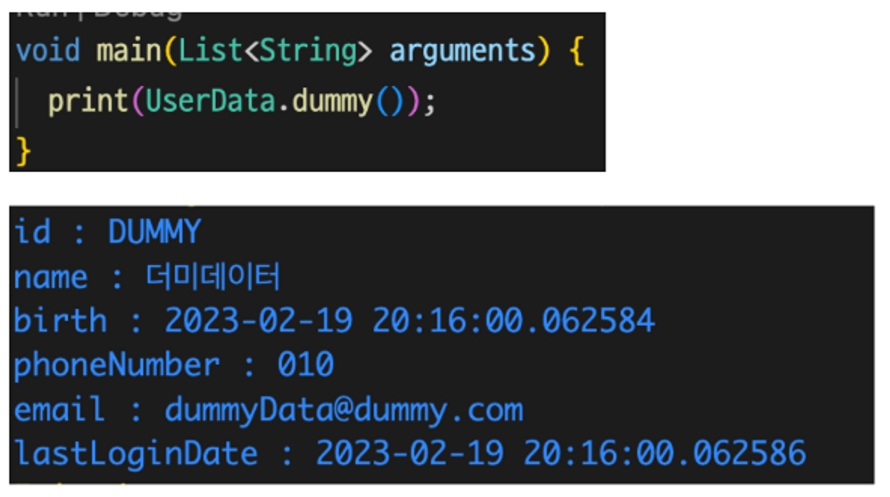
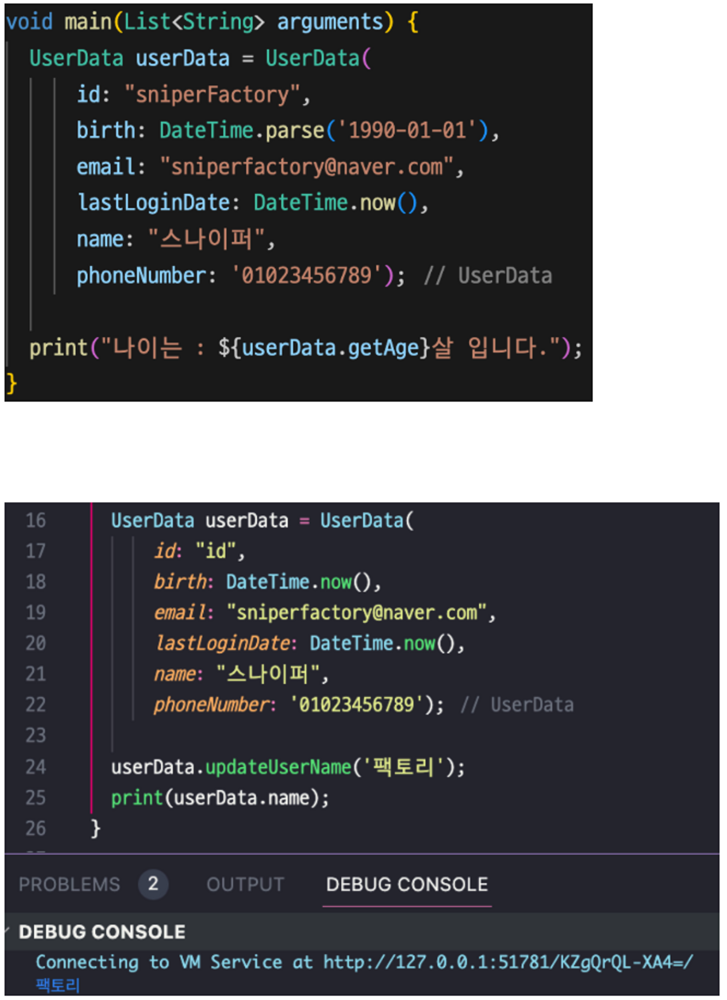

# day22

## 🧑‍💻 배운내용

### class, constructor, Dart: Method, Flutter에서의 활용

## 22일차 과제


1. **다음 설명을 읽고 직접 클래스를 만드시오.**
    - 카카오톡 유저에서 들어갈 수 있는 내용은 다음과 같다. 이 내용을 기준으로 클래스를 제작하여라.
    클래스 명은 User로 통일하도록 한다.
        
        ```bash
        이름
        전화번호
        이메일
        닉네임
        프로필이미지
        배경이미지
        친구목록
        즐겨찾기 목록
        ```
        
    - 이 때 존재하지 않을 수도 있는 데이터는 다음과 같다.
        - 닉네임이 존재하지 않을 수도 있다.
        - 프로필이미지가 존재하지 않을수도 있다.
        - 배경이미지가 존재하지 않을 수도 있다.
    
2. **다음은 UserData라는 이름의 클래스를 만드는 예시이다. 
다음의 코드를 보고, 생성자를 완성하라.**
    
    ```dart
    void main(List<String> arguments) {
    	UserData userData = UserData(
    		id: "id",
    		birth: DateTime.now(),
    		email:"sniperfactory@naver.com",
    		lastLoginDate: DateTime.now(),
    		name: "스나이퍼",
    		phoneNumber: '01023456789'
    	);
    }
    ```
    

3. **개발용으로 테스트 데이터가 필요할 때가 있다. 
다음과 같은 더미데이터를 품은 클래스 생성자를 만드시오.**
    

    
4. 클래스에 적용할 수 있는 **Getter와 Setter에 대해 공부하고, 다음의 결과를 만드시오.
이 때, Getter는 멤버변수와 무엇이 다른지 설명하는 것을 정리하시오.**



#### 코드는 assignment에 있습니다

