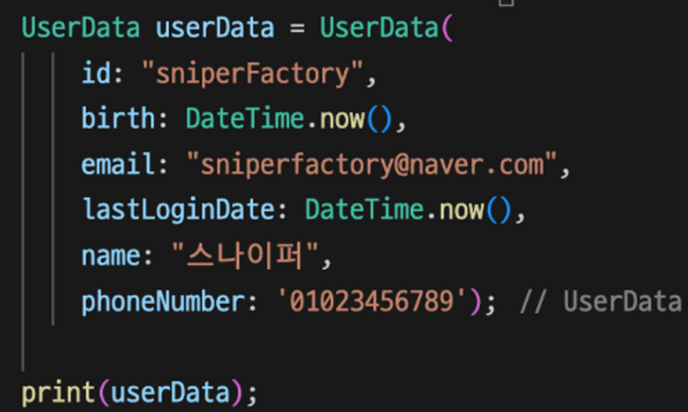
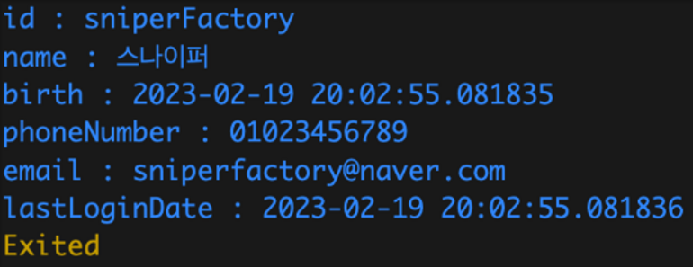

# day23

## 🧑‍💻 배운내용

### fromMap, toMap, toString, override

## 23일차 과제

1. **다음 코드를 실행시 얻을 수 있는 결과를 참고하여
UserData 클래스를 제작하고 toString를 새로 재정의하여 만드시오.**
    
    - **main함수내용**
    
    - 실행결과
    

2. **다음의 URL에 네트워크 요청을 보내고, 얻은 데이터를 Class를 통해 생성할 수 있도록 만드시오.**
    
    https://sniperfactory.com/sfac/http_json_data
    
    - 이 때 제작하는 Class 명은 자유입니다.
    - 받아온 네트워크 데이터를 Class에 적용시키고 플러터를 사용하여 다음의 화면을 제작합니다.
    

3. **아래 main함수가 실행될 수 있도록 Dart 프로젝트를 구성하고, 
지하철과 사람을 표현하는 클래스를 직접 구성하시오.**
    
    ```dart
    class Subway {
      //...
    }
    
    class Human {
      //...
    }
    
    void main() {
      // 인스턴스 생성
      var subway = Subway(line:'2호선', current: '홍대입구역', passengers:[]);
      var human1 = Human(name: '사람1', money: 5000, curSubway: null);
      var human2 = Human(name: '사람2', money: 3450, curSubway: null);
      var human3 = Human(name: '사람3', money: 450, curSubway: null);
     
      // 사람 탑승 
      print(human1.getOn(subway));
    	print(human2.getOn(subway));
      print(human3.getOn(subway));
    
      // 현재 지하철 탑승
      print(subway.toString()); 
     
      // 각 사람들의 현재 상태를 출력
      print(human1.toString());
    	print(human2.toString());
      print(human3.toString());
    }
    ```
    
    - **반드시 각 클래스는 생성자를 포함하도록 하세요.**
        - 이 때, Subway 클래스는 생성시에 생성되었다는 안내문구가 출력됩니다.
    - **메인함수(void main)는 일체 수정할 필요가 없습니다.**
    - 각 클래스는 toString의 메서드를 이용하여 아래의 실행결과와 일치하게 나올 수 있도록 합니다.
        - 그 외 멤버변수, 멤버함수는 자유입니다.
    - **실행결과(출력결과)는 다음과 같습니다.**

## 결과
